<picture>
  <source media="(prefers-color-scheme: dark)" srcset="assets/hero-dark.svg">
  <source media="(prefers-color-scheme: light)" srcset="assets/hero-light.svg">
  
</picture>

  

<picture>
  <source media="(prefers-color-scheme: dark)" srcset="assets/cards-dark.svg">
  <source media="(prefers-color-scheme: light)" srcset="assets/cards-light.svg">
  
</picture>

  

<picture>
  <source media="(prefers-color-scheme: dark)" srcset="assets/langs-dark.svg">
  <source media="(prefers-color-scheme: light)" srcset="assets/langs-light.svg">
  
</picture>

  

<picture>
  <source media="(prefers-color-scheme: dark)" srcset="assets/stack-dark.svg">
  <source media="(prefers-color-scheme: light)" srcset="assets/stack-light.svg">
  
</picture>

  

<picture>
  <source media="(prefers-color-scheme: dark)" srcset="assets/heading-work-dark.svg">
  <source media="(prefers-color-scheme: light)" srcset="assets/heading-work-light.svg">
  
</picture>

<a href="https://github.com/imsteamworks/polls"><picture>
  <source media="(prefers-color-scheme: dark)" srcset="assets/work-polls-dark.svg">
  <source media="(prefers-color-scheme: light)" srcset="assets/work-polls-light.svg">
  
</picture></a>

<a href="https://github.com/imsteamworks/ratio"><picture>
  <source media="(prefers-color-scheme: dark)" srcset="assets/work-ratio-dark.svg">
  <source media="(prefers-color-scheme: light)" srcset="assets/work-ratio-light.svg">
  
</picture></a>

<a href="https://github.com/imsteamworks/Minestom"><picture>
  <source media="(prefers-color-scheme: dark)" srcset="assets/work-minestom-dark.svg">
  <source media="(prefers-color-scheme: light)" srcset="assets/work-minestom-light.svg">
  
</picture></a>

<a href="https://github.com/imsteamworks/rollerite-trial"><picture>
  <source media="(prefers-color-scheme: dark)" srcset="assets/work-rollerite-trial-dark.svg">
  <source media="(prefers-color-scheme: light)" srcset="assets/work-rollerite-trial-light.svg">
  
</picture></a>

  

<a href="https://piglins.com"><picture>
  <source media="(prefers-color-scheme: dark)" srcset="assets/contact-piglins-com-dark.svg">
  <source media="(prefers-color-scheme: light)" srcset="assets/contact-piglins-com-light.svg">
  
</picture></a>
<picture>
  <source media="(prefers-color-scheme: dark)" srcset="assets/contact-discord-steamworks-dark.svg">
  <source media="(prefers-color-scheme: light)" srcset="assets/contact-discord-steamworks-light.svg">
  
</picture>
<a href="mailto:imsteamworks@gmail.com"><picture>
  <source media="(prefers-color-scheme: dark)" srcset="assets/contact-imsteamworks-gmail-com-dark.svg">
  <source media="(prefers-color-scheme: light)" srcset="assets/contact-imsteamworks-gmail-com-light.svg">
  
</picture></a>

